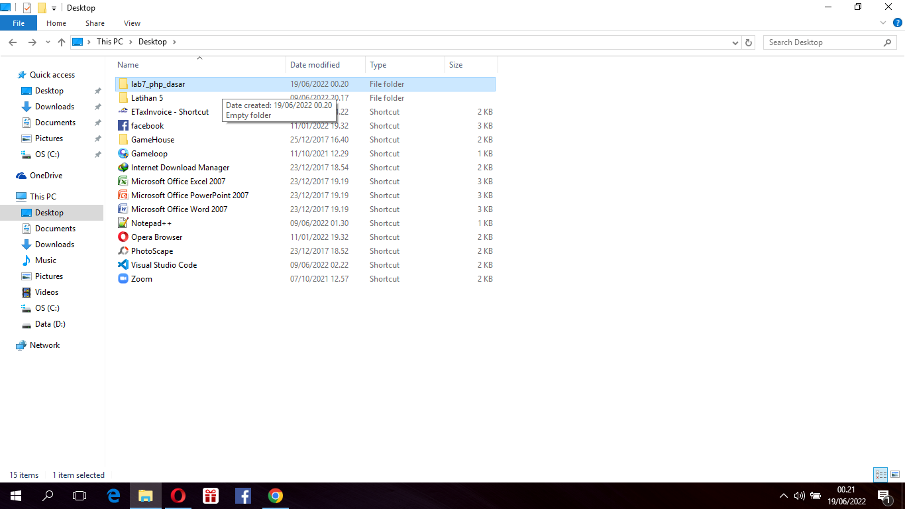
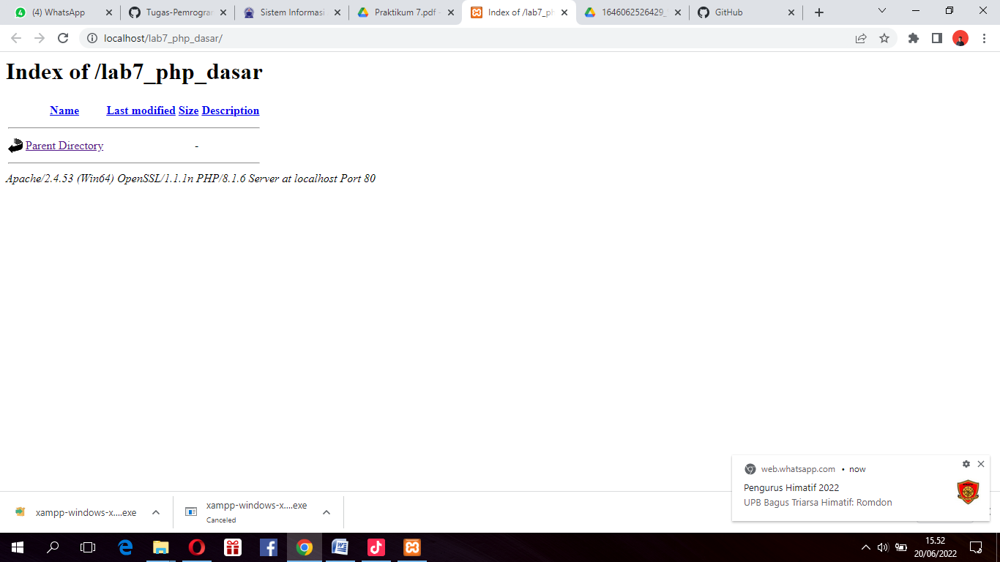
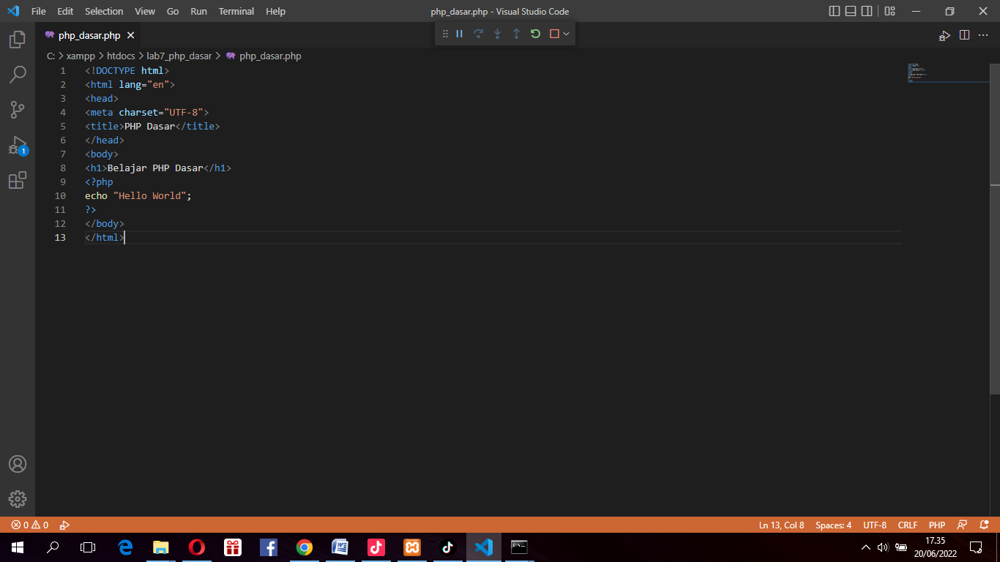
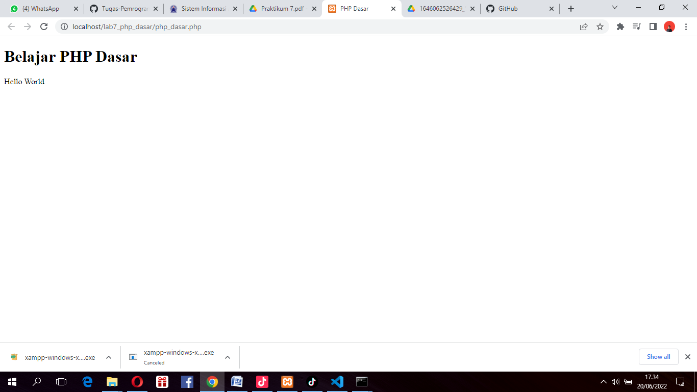
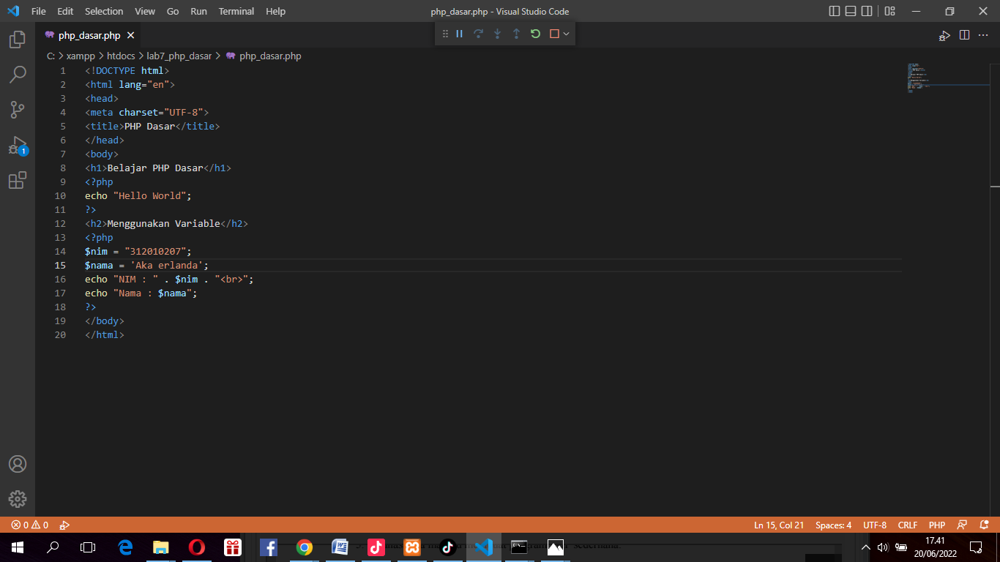
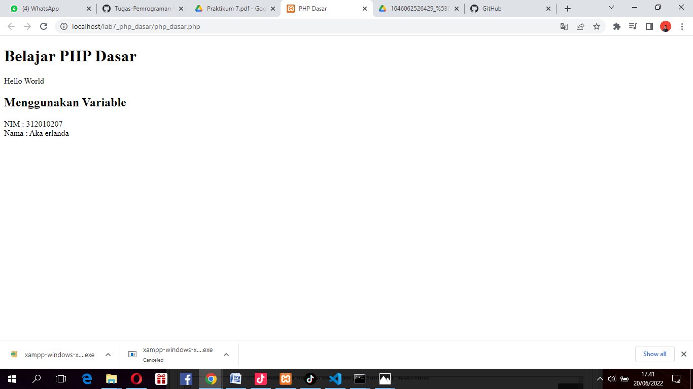

# Pratikum 7 Pemgrograman web
Repository ini dibuat untuk memenuhi tugas mata kuliah pemrograman web.

Nama    : Aka erlanda

Nim     : 312010207

Kelas   : TI.20.B.1

# Lab7Web

1. Memulai PHP

Buat folder lab7_php_dasar pada root directory web server misalnya (c:\xampp\htdocs)

Seperti contoh berikut :

Kemudian untuk mengakses direktory tersebut pada web server dengan mengakses URL : http://localhost/lab7_php_dasar/

Maka hasil nya seperti ini :

2. PHP Dasar

Buat file baru dengan nama "php_dasar.php" pada directory tersebut. 
Kemudian buat source kode seperti berikut :

Kemudian untuk mengakses hasilnya melalui URL: http://localhost/lab7_php_dasar/php_dasar.php

3. Variable PHP

Menambahkan variable pada program.

buka dengan crome dan di Refresh lalu hasilnya seperti berikut :

4. Predefine Variable $_GET

